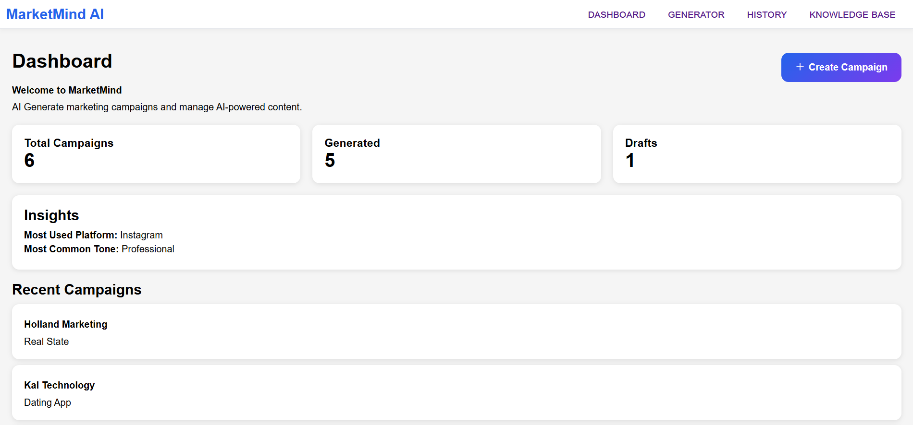
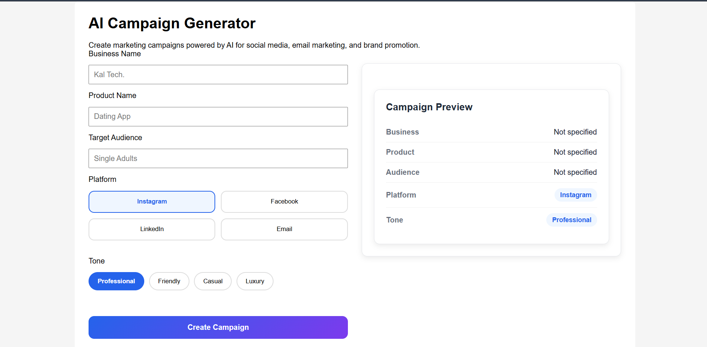
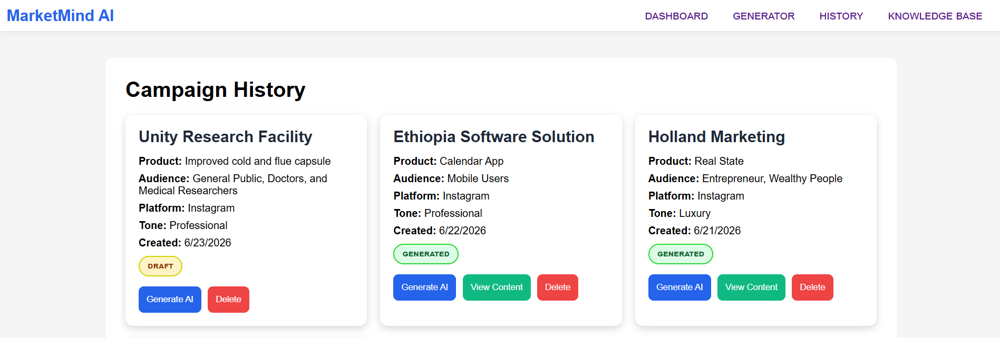
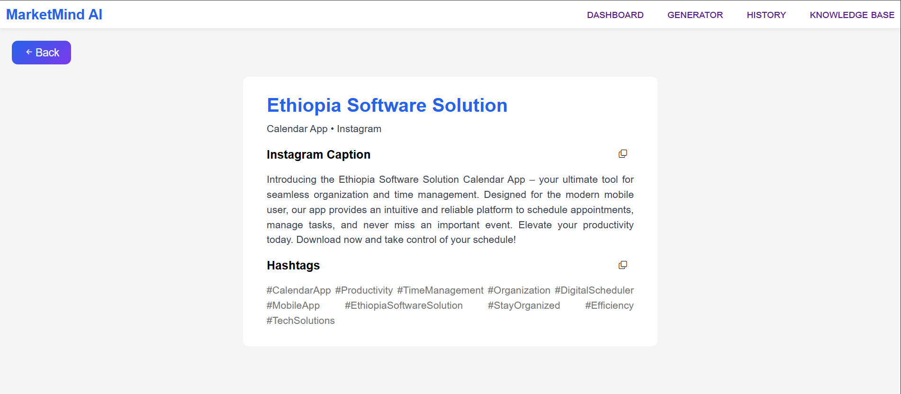
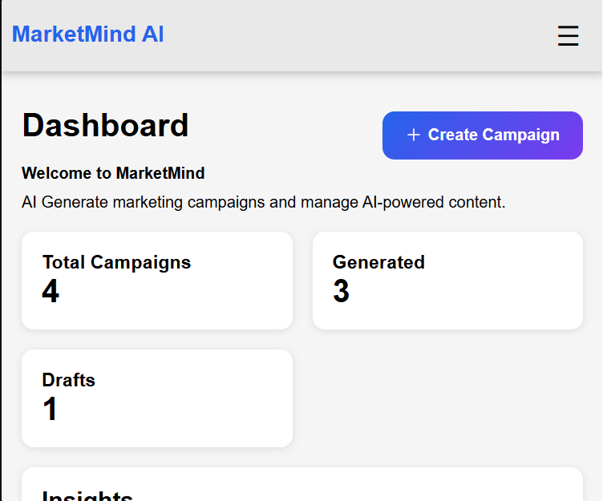

# MarketMind AI

AI-powered marketing campaign generator built with React, Node.js, Express, Supabase, and Google Gemini. MarketMind AI enables businesses and content creators to generate platform-specific marketing content using Google Gemini AI. Users can create campaigns, generate content, manage campaign history, and copy generated content for immediate use.

## Live Demo

Frontend: https://marketmind-ai-chi.vercel.app/

## Overview

MarketMind AI helps businesses generate marketing content using artificial intelligence. Users can create campaigns, store campaign information, generate AI-powered marketing content, and manage previously generated campaigns.

The application generates content such as:

- Instagram Captions
- Facebook Posts
- LinkedIn Posts
- Email Subjects
- Email Body Content
- Marketing Hashtags

## Features

- Create and save marketing campaigns
- AI-powered content generation using Google Gemini
- Campaign history management
- View generated content on a dedicated page
- Copy generated content to clipboard
- Responsive mobile navigation
- Dashboard with campaign statistics
- Knowledge Base page
- Toast notifications and loading states

## Tech Stack

### Frontend

- React
- React Router
- React Hot Toast
- CSS

### Backend

- Node.js
- Express

### Database

- Supabase

### AI

- Google Gemini API

### Deployment

- Vercel (Frontend)
- Render (Backend)

## Application Architecture

User → React Frontend → Express API → Gemini API

```
                                 ↓

                            Supabase Database
```

## Screenshots

### Dashboard



### Campaign Generator



### Campaign History



### Generated Content



### Mobile Responsive Design



## Installation

### Clone Repository

```bash
git clone https://github.com/Kale-89/marketmind-ai.git
```

### Backend Setup

```bash
cd server

npm install

```

Create a .env file:

```env
GEMINI_API_KEY= [place your own gemini api key here]

SUPABASE_URL= [Place your supabase url here]

SUPABASE_ANON_KEY= [place your supabase anon key here]
```

```bash
npm start
```

### Frontend Setup

```bash
cd client

npm install

```

Create a .env file:

```env
VITE_SUPABASE_URL= place your supabase url here

VITE_SUPABASE_ANON_KEY= place your anon key here

VITE_API_URL=http://localhost:5000

npm run dev
```

## Future Improvements

- User authentication
- Campaign editing
- AI content regeneration
- Export generated content
- Analytics dashboard
- Multi-user support

## Author

Kalehiwot Mulugeta

GitHub: https://github.com/Kale-89

LinkedIn: https://www.linkedin.com/in/kalehiwot-mulugeta/

Email: kalehiwotm@gmail.com

## License

This project is proprietary and all rights are reserved.
See the LICENSE file for details.
